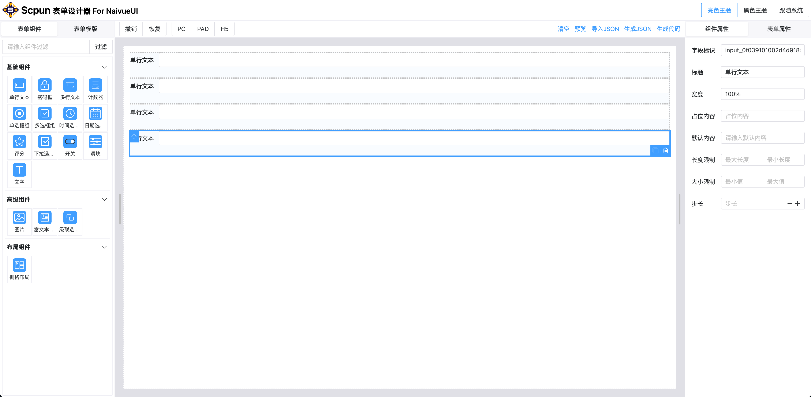

# scpun-form-naiveui (NaiveUI 表单设计器)

## 1.项目介绍
<p>
  <a href="https://github.com/vuejs/vue">
    
  </a>
  
  <a href="https://www.naiveui.com/">
    
  </a>
  
  <a href="https://www.npmjs.com/package/scpun/scpun-form-naiveui">
    
  </a>
  
  <a href="https://github.com/bruceywave/scpun-form-naiveui/blob/master/LICENSE">
    
  </a>
</p>

<p>
<a href="https://gitee.com/snove/scpun-form-naiveui.git">
  
  
   
  
</a>
<a href="https://gitee.com/snove/scpun-form-naiveui.git">
    
     
  </a>

  [](https://gitee.com/snove/scpun-form-naiveui)

</p>

### 支持功能
- 富文本编辑
- 图片上传
- 栅格布局
- 生成JSON
- 生成代码

### 示例

**npm引入**

<I>待补充</I>

## 2.组件说明

### 2.1.表单设计器`NaiveDesignForm`

#### 2.1.1.示例
```html
<template>
  <NaiveDesignForm ref="designForm" />
</template>
```

#### 2.1.2.API说明

- 属性说明
<I>待补充</I>
- 方法说明
<I>待补充</I>
- 字段说明
<I>待补充</I>

### 2.2 表单生成器`NaiveGenerateForm`

#### 2.2.1.示例

```html
<template>
  <NaiveGenerateForm ref="generateForm" />
</template>
```

#### 2.2.2.API说明
- 属性说明
<I>待补充</I>
- 方法说明
<I>待补充</I>
- 字段说明
<I>待补充</I>

## 3.功能说明

### 3.1.远端数据
<I>待补充</I>

### 3.2.文件上传
<I>待补充</I>

## 4.部分功能图片预览



